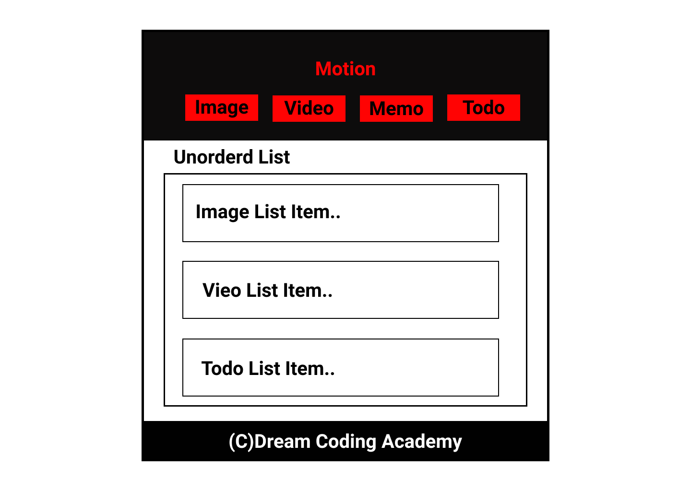
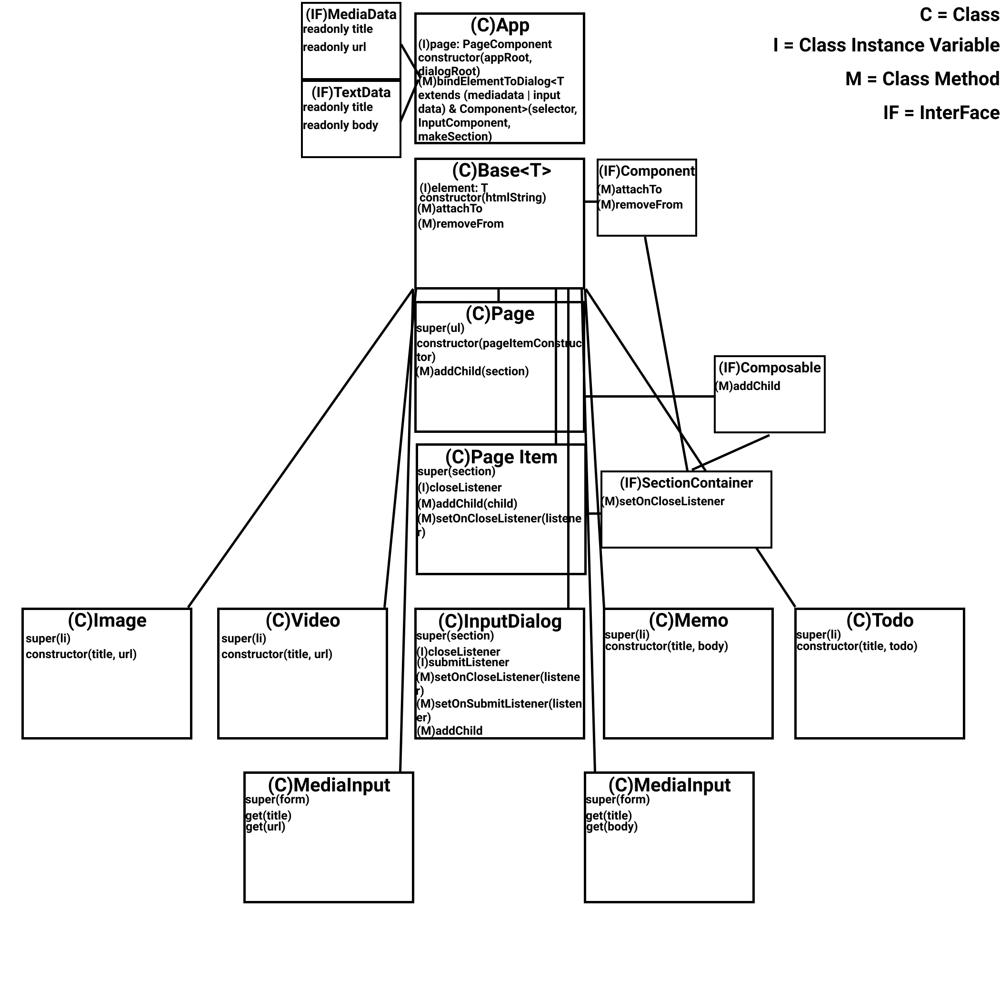

# TypeScript Motion Project

Learning TypeScript and Doing a Motion Project with Ellie Teacher

## Directory Structure

```
assets
|-- cool-background.png
|-- layout.png
dist
|-- ...
src
|-- components
|   |-- dialog
|   |   |-- input
|   |   |   |-- media-input.ts
|   |   |   |-- text-input.ts
|   |   |-- dialog.ts
|   |-- page
|   |   |-- item
|   |   |   |-- image.ts
|   |   |   |-- note.ts
|   |   |   |-- todo.ts
|   |   |   |-- video.ts
|   |   |-- page.ts
|   |-- base.ts
|-- app.ts
style
|-- style.ts
index.html
tsconfig.json

```

## Motion Layout

<br>
프로젝트의 레이아웃은 위와 같으며 심플한 기능 몇가지를 구현하고 있다.<br>

1. 헤더의 4종류 버튼을 클릭 시 각각 그에 맞는 모달창을 띄워주며 리스트 아이템을 추가할 수 있도록 한다.
2. 추가된 아이템들은 Drag & Drop을 통해 위치를 수정할 수 있다.<br>

+` 이번 프로젝트에서 가장 초점을 두고 있는 것은 객체지향 프로그래밍과 타입스크립트를 사용한 클래스와 인터페이스의 구현이다.`

## Motion Schematic

<br>
프로젝트를 복습하면서 컴포넌트의 관계 그리고 인터페이스 상속 관계등을 보다 알기쉽게 도식화하여 표현해보았다.(아쉽게도 타입까지 명세하면 너무 난잡하고 가독성이 떨어질 것 같아 보였으므로 적지 않았다.)<br>
객체지향을 공부하면서 느낀점은 함수형 프로그래밍에 비해 굉장히 체계적인 구조를 가지고 있으며 함수처럼 바로 만들어 사용하는 것이 아닌 구조를 정확히 만든 후 가져다 사용이 가능하다는 것이다.<br>
개인적으로 매우 큰 프로젝트를 하게 된다면 함수형 프로그래밍보다 객체지향을 사용하는 것이 좀 더 안정적이고 어떠한 것을 찾더라도 비교적 빠르게 읽어낼 수 있지 않을까라는 생각이 든다.<br>
아직은 객체지향이 낮설고 어렵게 느껴지기 때문에 함수형 프로그래밍을 더 선호하게 되지만 둘 다 잘하게 된다면 어떠한 패러다임을 선호하게 될까?<br>
역시 잘해지고 생각해보는 수밖에 없는 듯 하다.<br>
